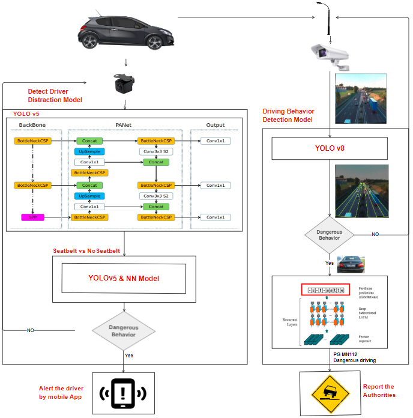

# HARIS: High Alert Recognition Intelligent System

  

## Table of Contents
- [Project Overview](#project-overview)
- [Key Features](#Key-Features)
- [Features](#features)
- [Technologies Used](#technologies-used)
- [Contributing](#contributing)
- [Acknowledgements](#Acknowledgements)

## Project Overview
HARIS (High Alert Recognition Intelligent System) is an AI-powered System designed to enhance road safety by detecting and analyzing driver and driving behaviors using in-car and road cameras. The primary goal is to create a safer driving environment by minimizing accidents caused by reckless driving and driver distractions.

## Key Features
### Driver Distraction Detection:
-Utilizes the YOLOv5 object detection model.

Detects and classifies multiple distraction classes with a precision of 95%.

-Seatbelt model
Detects the presence of seatbelts using YOLOv5 and classifies their usage with an additional neural network model.
This ensures accurate differentiation between fastened and unfastened seatbelts.

### Driving Behavior Detection:
Employs YOLOv8 and ByteTrack algorithms.

Detects various car behaviors and road lanes.

Achieves a Mean Average Precision (MAP) of 78% on training and 70% on validation at a 0.5 threshold.

### License Plate Recognition:
Uses YOLOv5 and a CRNN-based OCR model.

Recognizes car license plates with a line accuracy of 91%.

Identifies potentially dangerous vehicles.

## Features
- **Real-time Monitoring:** Continuously monitors driving behavior using sensors and cameras.
- **Behavior Analysis:** Analyzes driving patterns to detect aggressive driving, drowsiness, and distractions.
- **Data Visualization:** Offers comprehensive visualizations of driving data for analysis and reporting.

## Technologies Used
- **Programming Languages:** Python
- **Machine Learning Frameworks:** TensorFlow, Keras
- **Data Processing:** Pandas, NumPy
- **APIs:** OpenCV for image processing, various sensor APIs

### Demo Videos

You can find demo videos demonstrating HARIS in action [here](https://www.canva.com/design/DAGGtOHbFjE/4Kf2_ORL5W9Qm4B1J1thCQ/edit?utm_content=DAGGtOHbFjE&utm_campaign=designshare&utm_medium=link2&utm_source=sharebutton).

### Documentation

You can find the detailed documentation [here](https://drive.google.com/file/d/1Pywy5OnwpzJYuCayuzkzm201_yxQiJdH/view?usp=sharing).

## Contributing 👨‍🎓 👩‍🎓
- <a href="https://github.com/IsraaSaede" target="_blank">IsraaSaede</a>

- <a href="https://github.com/marah-ghanem" target="_blank">MarahAbuGhanem</a>

- <a href="https://github.com/Mo-Sam-Mo" target="_blank">Mohamed Samir</a>

- <a href="https://github.com/FatimahAdel" target="_blank">Fatima Adel</a>

- <a href="https://github.com/" target="_blank">Harisoa Anja</a>

- <a href="https://github.com/" target="_blank">Omar Mahmoud</a>

- <a href="https://github.com/samirahe21" target="_blank">Samira Essam</a>

## Acknowledgements
Special thanks to [Person/Organization] for [reason].
